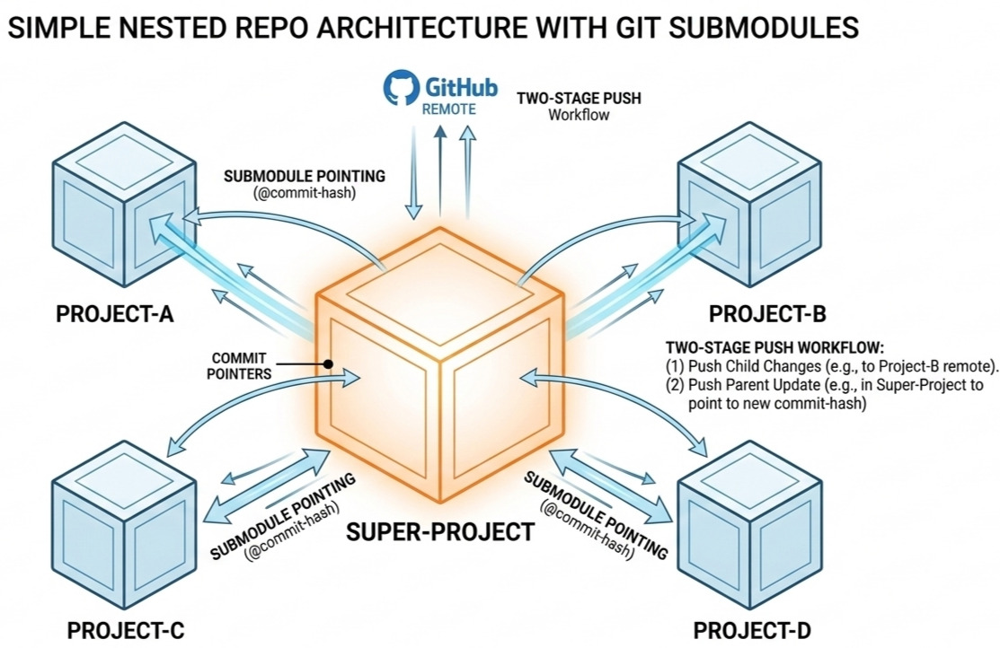

### The "nested repo" dilemma

As developers, our local workspaces often become a complex web of interconnected projects. You might have a main "Research" or "Portfolio" directory containing several independent tools, libraries, or experiments.

The challenge arises when you want to push this entire structure to GitHub. A standard `git init` at the root level ignores the history of the folders inside it, while simply nesting folders creates a "git-within-git" conflict that often leads to untracked files or broken links.

To maintain a clean, professional architecture where each project keeps its own independent history but remains accessible through a single "Super-Project" container, we use **Git Submodules**. This guide explains how to master this "pointer-based" workflow to keep your GitHub profile organized and your code modular.

---

### The "Super-Project" architecture

In this model, your parent directory doesn't store the actual code of the child projects. Instead, it stores **commit pointers** (metadata) that link to specific versions of those projects. This satisfies two critical requirements:

1. **Independent Version Control:** Each child directory remains its own Git repository with its own history and branches.
2. **Structural Integrity:** Your "Parent" repository acts as a functional map. Visitors see clickable folders that jump directly to the respective child repositories.

#### Phase 1: Prepare the child repositories
Before nesting, each child directory must exist as a standalone repository on GitHub.

1. Navigate into each child folder: `cd Project-A`.
2. Run `git init`, commit your files, and push them to a unique GitHub URL (e.g., `github.com/user/Project-A`).

#### Phase 2: Create the parent "Super-Project"
Now, link them together within your main workspace directory.

**Initialize the Parent:** From your main local root:

```bash
git init
```

**Add child repos as submodules:** Run this for every child project to link the remote URL to your local path:

```bash
git submodule add https://github.com/your-username/Project-A.git Project-A
git submodule add https://github.com/your-username/Project-B.git Project-B
```

**Commit the mapping:** You will notice a new `.gitmodules` file. This is the configuration file that tells GitHub how to render your directory structure.

```bash
git add .
git commit -m "feat: initialize structure with Project-A and Project-B as submodules"
```

**Push the parent to GitHub:** Create a "Main-Workspace" repo on GitHub and push the parent:

```bash
git remote add origin https://github.com/your-username/Main-Workspace.git
git push -u origin main
```

----

### The daily management workflow

When you modify code inside a child project, you must update the **pointer** in the parent repo. This requires a **two-stage push**. Think of it as updating the book (child) and then updating the library's index (parent).

#### Step 1: Push the child changes

First, ensure the child's remote is up to date. If you skip this, the parent will point to a commit that doesn't exist on the server, resulting in a "broken link" for other users.

```bash
cd path/to/child-project
git add .
git commit -m "fix: update biological simulation logic"
git push origin main
```

#### Step 2: Update the parent pointer

Now, tell the parent repository to "record" the new commit hash of the child.

```bash
cd ..
# Git sees the child folder as having a modified "commit pointer"
git add path/to/child-project 
git commit -m "chore: update child-project reference to latest commit"
git push origin main
```

---

### Verification and safety

#### How to verify on GitHub

1. Open your Parent Repository.
2. Look at the folder for your child project; you'll see a specific commit hash (e.g., `@a1b2c3d`) next to the name.
3. Click the folder. It should seamlessly redirect you to the child repository at that exact moment in history.

#### Tip: The "Safe" Push
To prevent "broken links," use this command from the **Parent Root**:

```bash
git push --recurse-submodules=check
```

This acts as a safety net: it will **abort the push** if you have committed changes in a submodule that haven't been pushed to their own remotes yet. It's the best way to ensure your collaborators (and your future self) never encounter a "Git ghost."

Hope you find this short guide useful for organizing your projects better!
